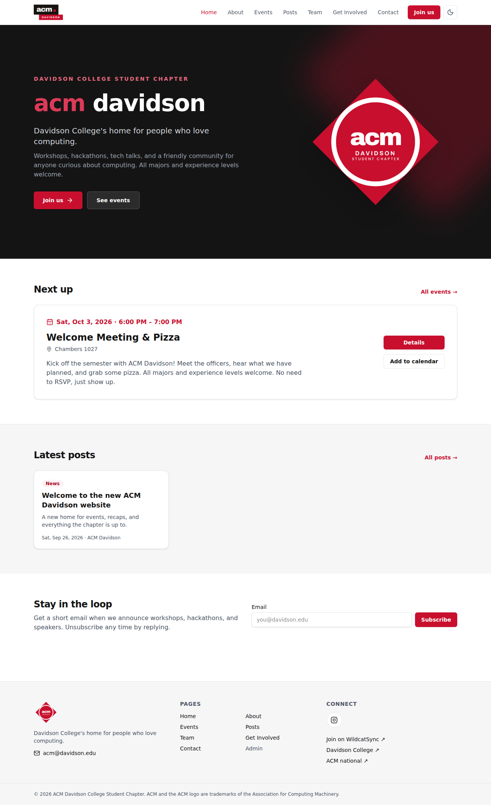

# ACM Davidson website

Website for the Davidson College student chapter of the Association for Computing Machinery.
Public site plus an admin dashboard for officers to manage posts, events, the team page,
contact-form messages, and the mailing list.



## Stack

- [Next.js 16](https://nextjs.org) (App Router, React 19, TypeScript)
- [Tailwind CSS 4](https://tailwindcss.com)
- [Prisma 6](https://www.prisma.io) with SQLite (switchable to Postgres, see below)
- Session auth with bcrypt-hashed passwords (no third-party auth service)
- Nodemailer for contact-form email, Cloudflare Turnstile (optional) for CAPTCHA

## Quick start

```bash
cp .env.example .env        # edit CHAPTER_EMAIL, ADMIN_*, and SMTP_* as needed
npm install
npm run db:migrate          # creates prisma/dev.db and runs migrations
npm run db:seed             # creates the admin user + a little sample content
npm run dev                 # http://localhost:3000
```

Sign in at `/admin/login` with `ADMIN_EMAIL` / `ADMIN_PASSWORD` from `.env`.
Change the password right away:

```bash
npm run create-admin -- you@davidson.edu "Your Name" "a-long-password"
```

That command also works for adding more officers as admins. Resetting a password signs that
account out of every device.

To seed only the admin user (no sample posts/events/officers):

```bash
SEED_SAMPLE_CONTENT=false npm run db:seed
```

## What's included

**Public site**

- Home: hero with "Join us", next upcoming event, three latest posts, mailing-list signup
- About, Events (upcoming + automatic past archive, `.ics` add-to-calendar), Posts (search by
  title/text/tag, tag filters), Team (current officers, past officers grouped by academic year),
  Get Involved (join steps, meeting info, mailing list, contact form), Contact
- Light/dark mode, sticky navbar with mobile hamburger menu, custom 404
- SEO: per-page titles/descriptions, Open Graph + Twitter cards, `robots.txt`, `sitemap.xml`,
  schema.org Event JSON-LD
- Accessibility: semantic landmarks, skip link, keyboard-navigable menus, visible focus rings,
  alt text required on every admin-uploaded image
- Performance: `next/image` lazy loading with responsive sizes, AVIF/WebP, cached uploads

**Admin dashboard** (`/admin`)

- Posts: Markdown editor with live preview, full-page preview, drafts vs. published, tags
- Events: date/time (Eastern), location, image, RSVP link; past events archive automatically
- Team: add/edit officers, reorder with arrows, archive individuals or a whole academic year
- Messages: every contact-form submission (also emailed when SMTP is configured)
- Subscribers: mailing list with CSV export
- Activity log: who created/edited/deleted/published what, and when
- Log out, and "log out all sessions"

**Spam protection**: honeypot field, per-IP rate limiting on forms and login, and optional
Cloudflare Turnstile (set both `TURNSTILE_*` keys in `.env`).

## Configuration

Chapter details (email, social links, meeting time/place, join URL) live in
`src/lib/site.ts`. Post tags are in the same file.

Environment variables are documented in `.env.example`.

### Email

Set `SMTP_HOST`, `SMTP_PORT`, `SMTP_USER`, `SMTP_PASS`, and `SMTP_FROM`. Any SMTP provider
works (Gmail with an app password, Resend, SendGrid, Mailgun, Davidson's SMTP relay). Without
SMTP, messages are still saved to the database and printed to the server log, and the admin
Messages page marks them "Not emailed".

### Images

Admin uploads go to `UPLOAD_DIR` (default `./uploads`) and are served at `/uploads/<name>`.
In production, point `UPLOAD_DIR` at a persistent volume. Admins can also paste any `https://`
image URL instead of uploading.

### Switching to Postgres

1. In `prisma/schema.prisma`, change `provider = "sqlite"` to `provider = "postgresql"`.
2. Set `DATABASE_URL` to your Postgres connection string.
3. Delete `prisma/migrations` and run `npm run db:migrate` to create a fresh initial migration.

## Deploying

The app needs a Node server with a writable disk for SQLite and uploads (a small VPS, Fly.io,
Railway, Render, or a Docker host all work). Build and run with:

```bash
npm run build
npm run db:deploy          # apply migrations
npm start                  # serves on PORT (default 3000)
```

Set `NEXT_PUBLIC_SITE_URL` to the public URL so link previews and calendar files use the right
domain. Put the site behind HTTPS so the session cookie is marked `Secure`.

Vercel or other serverless hosts work too if you switch to Postgres and store uploads on
object storage (or use image URLs only).

## Scripts

| Command                | What it does                                  |
| ---------------------- | --------------------------------------------- |
| `npm run dev`          | Development server                            |
| `npm run build`        | Production build (also runs `prisma generate`)|
| `npm start`            | Run the production build                      |
| `npm run typecheck`    | TypeScript check                              |
| `npm run db:migrate`   | Create/apply migrations in development        |
| `npm run db:deploy`    | Apply migrations in production                |
| `npm run db:seed`      | Seed admin user and sample content            |
| `npm run db:studio`    | Browse the database in Prisma Studio          |
| `npm run create-admin` | Create or reset an admin account              |

## Project layout

```
prisma/               schema, migrations, seed
public/images/        chapter logos
scripts/              create-admin.ts
src/actions/          server actions (public forms, admin CRUD, auth)
src/app/(site)/       public pages
src/app/admin/        login, dashboard pages, post preview
src/app/api/          upload + CSV export route handlers
src/app/uploads/      serves uploaded images
src/components/       UI, navbar/footer, cards, forms, admin editors
src/lib/              db, auth, email, rate limiting, ICS, site config, helpers
```
